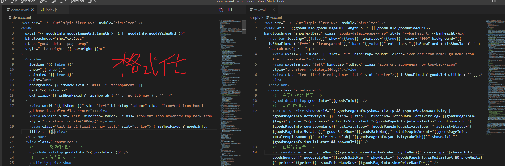

# wxml-pretty README

该扩展可以提供美观的wxml文件格式化。

 

效果图如下：
左图为美化后的代码，右边为原图



生成为 wxml 时，
- text 文本的内容将不会进行换行，防止内容掉落。
- 子元素有多个时，会进行换行展示，
- 单个子元素并且为纯文本时，将不会换行展示
- wxs 标签会**检查** ```module``` 属性 和 内容的导出
- 标签未正确闭合时，将会抛出错误
## 安装
直接在 vs code 插件扩展搜索 ``` wxml-pretty ```，安装即可

## 使用
保存自动格式化默认开启，如果不需要格式化，可以在设置 -> wxml-pretty.format设置为 false。


默认的配置项如下：
```json
{
  "wxml-pretty.format": true, // 是否开启格式化wxml
  "wxml-pretty.maxWidth": 120, // 宽度大于该值时将会换行
}
```
开启保存自动格式化(上方为默认选项)

## Q&A

### 1. 保存时格式不正确

答案： 需要 **选择正确的格式化工具**，
  1. 在 ```wxml```文件中，按下 ```ctrl + shift + P```，打开命令面板
  2. 输入 ```format```，选择 ```Format Document With...```
  3. 选择最下方的 ```Configure Default Formatter...```
  4. 最后选中```wxml-pretty```即可。
